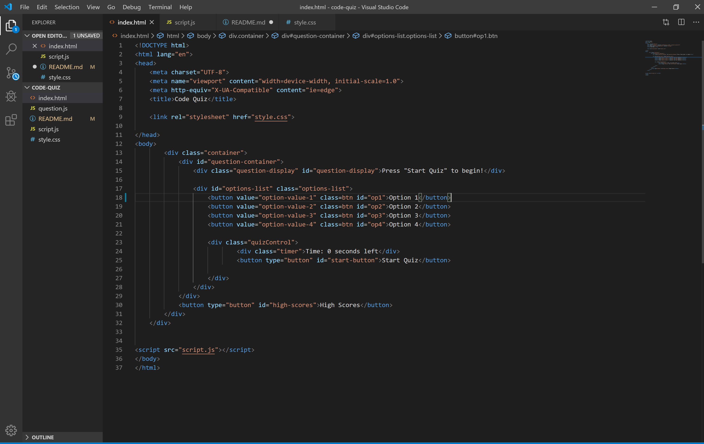
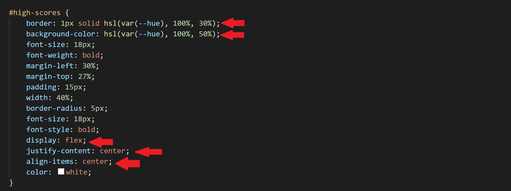
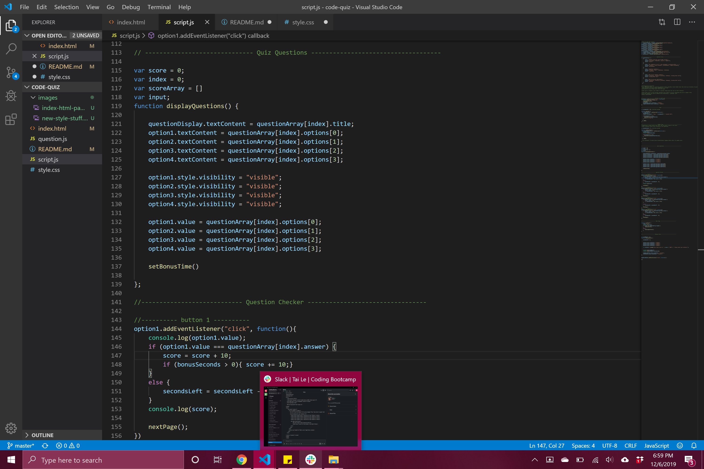

# Project Title: Code Quiz
​
This project has got to be, by far, the most challenging one i've encountered thus far. It required numerous rewrites, quite a bit of sanity and its very possible that i nearly broke google...or i'm due to recieve an award. Either are possible. The point of this activity was to create, from scratch, a quiz/questionare that was not only timed and fully interactive but also recorded the user's score to local storage.
​
## Getting Started
​
As with most projects, i began initially by creating the necessary document i would need which included an index.html, style.css and a scrip.js. I also created a question.js to store the related questions for the code quiz but later decided against using it.

I started working on the index.html file, laying down the bones for my creation. I found this part to be the easiest of the entire project and really only made slight alterations over time to IDs, classes and the buttons (though most changes were purely cosmetic such as changing the id names to get better organized).

If you look through the script.js, index.html and stle.css, you'll definitely find that i got a bit OCD on each page with organizing my code. This was a challenging project and staying organized became an absolute must if i were to maintain my mental health.

After i finished with most of the HTML, i was unsure of the approach into the javascript so i dove into styling with css. I initially planned to use bootstrab but realized i'd have a lot more fun playing around with the css. If anything, it was therapudic and helped me organize my thoughts and properly psudo code by way into the script.js. I encountered some issues with the css file but mostly those were as a result of my experimenting with new techniques and concepts. The last project thatutilized primarily css for styling was actually my first. I can definitely say "i've come a long way since then".

in the image above, the red arrows point to the css techniques i was referring to.

After finishing up with the styling, i finally made my way into the javascript. To be completely honest, nearly everything i did on the page was a struggle. The hardest parts were getting the question array content onto the buttons and then establishing eventlisteners to each in order to transition from function to function adding to score/subtracting from the timer all while properly displaying each question and the available answer options. I had to add values to the buttons and incorporate a lot of conditionals for even the smallest of thinghs. I can't stress enough how important staying organized proved to be in all this as well as taking each step one at a time. The entire project was a massive challenge but i got through it and even mannaged to help a few people with things that i, myself, had struggled through. In the end i feel proud to have completed it.

Here is an example of how i mannaged to stay organized:

This is also the section that gave me the most trouble.

After that i encountered some complications with storing local data but nothing too bad.

​
## Built With
​
* [HTML](https://developer.mozilla.org/en-US/docs/Web/HTML)
* [CSS](https://developer.mozilla.org/en-US/docs/Web/CSS)
* [Javascript](https://developer.mozilla.org/en-US/docs/Web/JavaScript)
​
## Deployed Link
​
* [See Live Site](https://casey-moldavon.github.io/code-quiz/)
​
​
## Authors
​
* **YOUR NAME** 
​
- [Link to Portfolio Site](https://casey-moldavon.github.io/code-quiz/)
- [Link to Github](https://github.com/casey-moldavon/code-quiz)
- [Link to LinkedIn](https://www.linkedin.com/in/casey-moldavon-442a1761/)
​
See also the list of [contributors](https://github.com/your/project/contributors) who participated in this project.
​
## License
​
This project is licensed under the MIT License 
​
## Acknowledgments
​
I'd like to give a big hat tip to Alexis and Amanda. They were both a huge help with many stages and comprehension. And of course, a big thank you to the instructor and TAs.